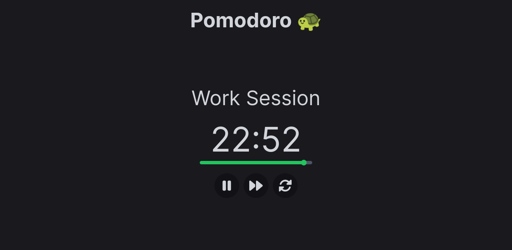

# pomodoro-app 
 A simple Pomodoro app build with Nuxt.js 3.

## Table of contents

- [Overview](#overview)
  - [The project](#the-project)
  - [Screenshot](#screenshot)
  - [Links](#links)
- [Process](#process)
  - [Built with](#built-with)
- [Author](#author)

## Overview

### The project

It's a simple pomodoro app, with play, pause, skip session and reset buttons.

### Screenshot

### Links

- [Live Site URL](https://pomodoro-app-luizhf42.vercel.app/)

## Process

### Built with

- HTML5
- CSS3
- TailwindCSS
- TypeScript
- Vue.js
- Nuxt.js 3

## Author

- [Luiz Henrique Felix. 🐢](https://www.linkedin.com/in/luiz-henrique-felix)

